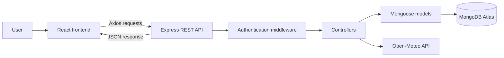

# WanderList

WanderList is a full-stack MERN travel itinerary planner. Users can securely create an account, organize trips, manage itinerary activities, search for destinations, and view live destination weather forecasts.

## Features

- Secure user registration, login, logout, and protected routes
- Password hashing with bcrypt
- JWT authentication stored in an HTTP-only cookie
- Create, read, update, and delete trips
- Add and remove itinerary activities
- Search, filter, and sort trips
- Dashboard statistics generated with MongoDB aggregation
- Destination search using the Open-Meteo Geocoding API
- Live weather forecasts using the Open-Meteo Forecast API
- Responsive interface for desktop, tablet, and mobile devices
- Loading states, form validation, and API error messages
- Modern interface with reusable React components

## Screenshots

### Dashboard

The dashboard displays user-specific trip statistics, search controls, filters, sorting, and responsive trip cards.


### Trip Details and Live Weather

The trip-details page combines saved MongoDB trip data, itinerary activities, and a live Open-Meteo forecast.


## Technology Stack

### Frontend

- React
- Vite
- React Router
- Axios
- CSS

### Backend

- Node.js
- Express.js
- MongoDB
- Mongoose
- JSON Web Tokens
- bcrypt
- Helmet
- Express Rate Limit
- Cookie Parser

### External API

- [Open-Meteo](https://open-meteo.com/) for destination searches and weather forecasts

## Application Architecture



The React frontend sends asynchronous HTTP requests to the Express REST API. Protected requests are checked by the authentication middleware. Controllers apply the application logic, Mongoose communicates with MongoDB Atlas, and the weather service communicates with Open-Meteo.

## MongoDB Features

The application demonstrates several MongoDB and Mongoose features:

- Mongoose schemas with validation and default values
- Embedded itinerary activity documents
- Compound indexes for user, date, and status queries
- Text indexes for trip searching
- A `2dsphere` geospatial index for destination coordinates
- MongoDB aggregation for dashboard statistics
- `$facet`, `$group`, `$sum`, `$size`, and `$cond` aggregation operators
- Pagination, filtering, and sorting
- User-specific queries that prevent access to another user's trips

## Project Structure

```text
WanderList/
├── backend/
│   ├── src/
│   │   ├── config/
│   │   │   └── db.js
│   │   ├── controllers/
│   │   │   ├── authController.js
│   │   │   ├── tripController.js
│   │   │   └── weatherController.js
│   │   ├── middleware/
│   │   │   ├── authMiddleware.js
│   │   │   └── errorMiddleware.js
│   │   ├── models/
│   │   │   ├── Trip.js
│   │   │   └── User.js
│   │   ├── routes/
│   │   │   ├── authRoutes.js
│   │   │   ├── healthRoutes.js
│   │   │   ├── tripRoutes.js
│   │   │   └── weatherRoutes.js
│   │   ├── services/
│   │   │   └── weatherService.js
│   │   ├── utils/
│   │   │   └── token.js
│   │   ├── app.js
│   │   └── server.js
│   ├── .env.example
│   └── package.json
├── frontend/
│   ├── src/
│   │   ├── components/
│   │   ├── context/
│   │   ├── pages/
│   │   ├── services/
│   │   ├── styles/
│   │   ├── App.jsx
│   │   └── main.jsx
│   ├── .env.example
│   └── package.json
├── .gitignore
├── package.json
└── README.md
```

## Local Installation

### Requirements

Install the following before running the application:

- Node.js
- npm
- Git
- A MongoDB Atlas account

### 1. Clone the repository

```powershell
git clone https://github.com/Davidimbertt/wanderlist-mern.git
cd wanderlist-mern
```

### 2. Install the root dependency

```powershell
npm install
```

### 3. Install backend and frontend dependencies

```powershell
npm run install:all
```

### 4. Configure the backend environment

Create `backend/.env` using `backend/.env.example` as a guide:

```env
PORT=5000
NODE_ENV=development
CLIENT_URL=http://localhost:5173
MONGO_URI=your_mongodb_connection_string
JWT_SECRET=your_secure_random_secret
JWT_EXPIRES_IN=7d
COOKIE_EXPIRES_DAYS=7
```

### 5. Configure the frontend environment

Create `frontend/.env` using `frontend/.env.example` as a guide:

```env
VITE_API_URL=http://localhost:5000/api
```

Never commit either `.env` file. They contain private configuration values and are excluded by `.gitignore`.

### 6. Start the application

From the main WanderList folder, run:

```powershell
npm run dev
```

This starts both parts of the application:

- Frontend: `http://localhost:5173`
- Backend: `http://localhost:5000`
- Health endpoint: `http://localhost:5000/api/health`

## Available Commands

| Command | Purpose |
|---|---|
| `npm run dev` | Start the backend and frontend together |
| `npm run install:all` | Install backend and frontend dependencies |
| `npm run lint` | Run the frontend ESLint check |
| `npm run build` | Create a production frontend build |
| `npm start` | Start the backend without Nodemon |

## REST API Endpoints

### Authentication

| Method | Endpoint | Description | Protected |
|---|---|---|---|
| POST | `/api/auth/register` | Register a new user | No |
| POST | `/api/auth/login` | Log in a user | No |
| POST | `/api/auth/logout` | Log out the current user | No |
| GET | `/api/auth/me` | Return the authenticated user | Yes |

### Trips

| Method | Endpoint | Description | Protected |
|---|---|---|---|
| GET | `/api/trips` | Return the current user's trips | Yes |
| POST | `/api/trips` | Create a trip | Yes |
| GET | `/api/trips/stats` | Return dashboard statistics | Yes |
| GET | `/api/trips/:id` | Return one trip | Yes |
| PATCH | `/api/trips/:id` | Update a trip or its activities | Yes |
| DELETE | `/api/trips/:id` | Delete a trip | Yes |

### Weather

| Method | Endpoint | Description | Protected |
|---|---|---|---|
| GET | `/api/weather/locations?q=Boston` | Search for destination coordinates | Yes |
| GET | `/api/weather/forecast?latitude=42.36&longitude=-71.06` | Return a weather forecast | Yes |

## Authentication and Security

WanderList includes the following security practices:

- Passwords are hashed before being stored
- JWTs are stored in HTTP-only cookies
- Protected backend routes require valid authentication
- Trip queries are restricted to the authenticated user
- Authentication and API rate limiting
- Helmet security headers
- Restricted CORS configuration
- JSON request-size limits
- Centralized error-handling middleware
- Environment variables for private configuration
- Production error responses hide server stack traces

## Error Handling

The backend returns consistent JSON error responses. It handles:

- Invalid form data
- Invalid MongoDB document IDs
- Duplicate email addresses
- Missing authentication
- Unauthorized resource access
- Missing API routes
- MongoDB validation errors
- External weather API failures

## Demonstration Flow

A recommended live demonstration is:

1. Register a new account.
2. Log out and log back in.
3. Create a trip using destination search.
4. Show the trip on the dashboard.
5. Demonstrate the statistics, search, filters, and sorting.
6. Open the trip and show its live weather forecast.
7. Add an itinerary activity.
8. Edit the trip.
9. Delete a temporary trip.
10. Refresh the browser to demonstrate persistent authentication.

## Key Technical Decisions

- MongoDB was selected because trips naturally contain nested itinerary activity data.
- Activities are embedded inside each trip because they belong directly to that trip.
- Authentication uses an HTTP-only cookie to reduce exposure of the token to frontend JavaScript.
- Open-Meteo was selected because it is open-source friendly and does not require an API key.
- Weather requests go through the backend to keep third-party API logic separate from React.
- Controllers, routes, models, middleware, services, and UI components are separated to keep the application maintainable.
- One root command starts both development servers, making the live demonstration more reliable.

## Verification

The project can be checked with:

```powershell
npm run lint
npm run build
```

The application has also been manually tested for:

- User registration and duplicate-account handling
- Login, logout, and authentication persistence
- Protected frontend and backend routes
- Trip creation, reading, editing, and deletion
- Activity management
- Search, filtering, sorting, and statistics
- Destination search and weather forecasts
- Responsive layouts

## Future Improvements

Possible future additions include:

- Trip sharing and collaboration
- Map visualization using destination coordinates
- Image uploads
- Email reminders
- Drag-and-drop itinerary ordering
- Automated backend and frontend tests

## Author

David Imbert

## License

This project is licensed under the MIT License.