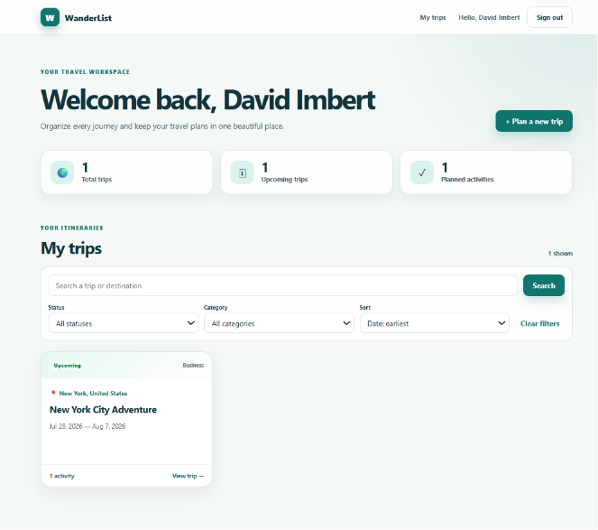
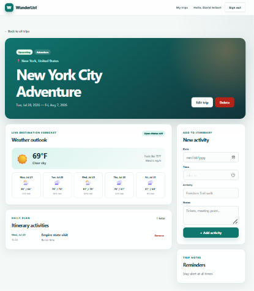
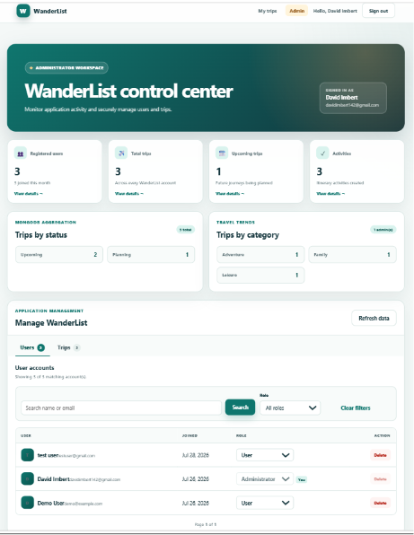
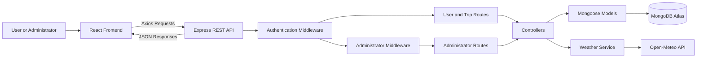

# WanderList

WanderList is a full-stack MERN travel itinerary planner with secure authentication, trip and activity management, live destination weather forecasts, MongoDB analytics, and a protected administrator dashboard.

Users can create accounts, organize trips, build daily itineraries, search destinations, and view forecasts. Administrators can monitor application-wide statistics, manage user roles, search and paginate records, and remove users or trips through protected role-based routes.

## Features

### User Features

- Secure registration, login, logout, and authentication persistence
- JWT authentication stored in an HTTP-only cookie
- Password hashing with bcrypt
- Protected React and Express routes
- Create, read, update, and delete trips
- Add and remove itinerary activities
- Search trips and destinations
- Filter trips by status and category
- Sort trips by date, title, or creation time
- User-specific MongoDB statistics
- Interactive dashboard statistic cards
- Live destination search with Open-Meteo
- Live weather forecasts
- Responsive desktop, tablet, and mobile design
- Form validation, loading states, and API error messages

### Administrator Features

- Role-based administrator authorization
- Protected `/admin` React route
- Protected `/api/admin` Express routes
- Application-wide MongoDB aggregation statistics
- Registered-user, administrator, trip, activity, status, and category totals
- Interactive aggregation results that filter trip records
- Search users by name or email
- Filter users by role
- Search trips by title, city, country, or owner
- Filter trips by status and category
- Server-side pagination
- Promote users to administrators
- Return administrators to the regular-user role
- Delete users and their associated trips
- Delete any trip
- Protection against deleting or demoting the current administrator
- Reusable confirmation modal
- Reusable success and error toast notifications
- Responsive administrator tables and controls

## Screenshots

### User Dashboard

The user dashboard displays personalized trip statistics, interactive statistic cards, search controls, filters, sorting, and responsive trip cards.



### Trip Details and Live Weather

The trip-details page combines saved MongoDB data, itinerary activities, destination notes, and a live Open-Meteo weather forecast.



### Administrator Dashboard

The protected administrator dashboard displays application-wide MongoDB aggregation statistics and provides user-role management, user and trip search, filters, pagination, custom confirmation dialogs, and toast notifications.



## Technology Stack

### Frontend

- React
- Vite
- React Router
- Axios
- Context API
- Standard CSS

### Backend

- Node.js
- Express.js
- MongoDB
- MongoDB Atlas
- Mongoose
- JSON Web Tokens
- bcrypt
- Helmet
- Express Rate Limit
- CORS
- Cookie Parser
- dotenv

### External API

- [Open-Meteo](https://open-meteo.com/) Geocoding API
- [Open-Meteo](https://open-meteo.com/) Forecast API

Open-Meteo was selected because it is public, open-source friendly, and does not require an API key.

## Application Architecture



The React frontend sends asynchronous requests to the Express REST API using Axios. Authentication middleware validates the JWT cookie. Administrator routes include a second authorization check that requires the authenticated user to have the `admin` role.

Controllers apply application logic, Mongoose communicates with MongoDB Atlas, and a separate weather service communicates with Open-Meteo.

## Request and Data Flow

A typical protected request follows this path:

1. A user performs an action in React.
2. React sends an Axios request to Express.
3. The browser automatically includes the HTTP-only authentication cookie.
4. Authentication middleware verifies the JWT.
5. Mongoose loads the current user from MongoDB.
6. Administrator routes also verify the user's role.
7. A controller validates and processes the request.
8. Mongoose queries or updates MongoDB.
9. Express returns a JSON response.
10. React updates component state and renders the result.

## MongoDB and Mongoose Features

WanderList demonstrates the following MongoDB and Mongoose features:

- Mongoose schemas with validation
- Required fields and default values
- Enumerated trip statuses, categories, and user roles
- Password hashing middleware
- Embedded itinerary activity documents
- References between trips and users
- Populated user information in administrator trip results
- Compound indexes for common user, date, role, and status queries
- Text indexes for trip searching
- A `2dsphere` geospatial index for destination coordinates
- User-specific resource queries
- Server-side search, filtering, sorting, and pagination
- MongoDB aggregation pipelines
- `$facet`
- `$group`
- `$sum`
- `$size`
- `$cond`
- `$gte`
- `$ne`
- Parallel queries with `Promise.all`

The aggregation pipelines calculate both user-specific dashboard statistics and application-wide administrator analytics.

## Project Structure

```text
WanderList/
|-- backend/
|   |-- src/
|   |   |-- config/
|   |   |   `-- db.js
|   |   |-- controllers/
|   |   |   |-- adminController.js
|   |   |   |-- authController.js
|   |   |   |-- tripController.js
|   |   |   `-- weatherController.js
|   |   |-- middleware/
|   |   |   |-- authMiddleware.js
|   |   |   `-- errorMiddleware.js
|   |   |-- models/
|   |   |   |-- Trip.js
|   |   |   `-- User.js
|   |   |-- routes/
|   |   |   |-- adminRoutes.js
|   |   |   |-- authRoutes.js
|   |   |   |-- healthRoutes.js
|   |   |   |-- tripRoutes.js
|   |   |   `-- weatherRoutes.js
|   |   |-- scripts/
|   |   |   `-- makeAdmin.js
|   |   |-- services/
|   |   |   `-- weatherService.js
|   |   |-- utils/
|   |   |   `-- token.js
|   |   |-- app.js
|   |   `-- server.js
|   |-- .env.example
|   `-- package.json
|-- frontend/
|   |-- src/
|   |   |-- components/
|   |   |   |-- AdminPagination.jsx
|   |   |   |-- AdminRoute.jsx
|   |   |   |-- AdminStatCard.jsx
|   |   |   |-- AdminTripsTable.jsx
|   |   |   |-- AdminUsersTable.jsx
|   |   |   |-- AppHeader.jsx
|   |   |   |-- ConfirmModal.jsx
|   |   |   |-- ProtectedRoute.jsx
|   |   |   |-- Toast.jsx
|   |   |   `-- TripCard.jsx
|   |   |-- context/
|   |   |   |-- authContext.js
|   |   |   |-- AuthProvider.jsx
|   |   |   `-- useAuth.js
|   |   |-- pages/
|   |   |   |-- AdminDashboardPage.jsx
|   |   |   |-- DashboardPage.jsx
|   |   |   |-- LoginPage.jsx
|   |   |   |-- RegisterPage.jsx
|   |   |   |-- TripDetailsPage.jsx
|   |   |   `-- TripFormPage.jsx
|   |   |-- services/
|   |   |   |-- adminService.js
|   |   |   |-- api.js
|   |   |   |-- tripService.js
|   |   |   `-- weatherService.js
|   |   |-- styles/
|   |   |   `-- global.css
|   |   |-- App.jsx
|   |   `-- main.jsx
|   |-- .env.example
|   `-- package.json
|-- docs/
|   `-- screenshots/
|       |-- admin-dashboard.png
|       |-- dashboard.png
|       `-- trip-details.png
|-- .gitignore
|-- package.json
`-- README.md
```

## Local Installation

### Requirements

Install:

- Node.js
- npm
- Git
- A MongoDB Atlas account

### 1. Clone the repository

```powershell
git clone https://github.com/Davidimbertt/wanderlist-mern.git
cd wanderlist-mern
```

### 2. Install the root dependency

```powershell
npm install
```

### 3. Install backend and frontend dependencies

```powershell
npm run install:all
```

### 4. Configure the backend environment

Create `backend/.env` using `backend/.env.example`:

```env
PORT=5000
NODE_ENV=development
CLIENT_URL=http://localhost:5173
MONGO_URI=your_mongodb_connection_string
JWT_SECRET=your_secure_random_secret
JWT_EXPIRES_IN=7d
COOKIE_EXPIRES_DAYS=7
```

### 5. Configure the frontend environment

Create `frontend/.env` using `frontend/.env.example`:

```env
VITE_API_URL=http://localhost:5000/api
```

Never commit either `.env` file. They contain private configuration values and are excluded through `.gitignore`.

### 6. Start the application

From the main WanderList folder:

```powershell
npm run dev
```

This starts:

- Frontend: `http://localhost:5173`
- Backend: `http://localhost:5000`
- Health endpoint: `http://localhost:5000/api/health`

## Creating an Administrator

New registrations always receive the regular `user` role. Registration requests cannot create administrators.

To promote an existing account, open a terminal in the backend folder:

```powershell
cd backend
npm run make-admin -- account@example.com
cd ..
```

Replace `account@example.com` with the email address of an existing WanderList account.

The promotion script connects to MongoDB, finds the account, changes its role, and closes the database connection.

## Available Commands

| Command | Purpose |
|---|---|
| `npm run dev` | Start the backend and frontend together |
| `npm run install:all` | Install backend and frontend dependencies |
| `npm run lint` | Run the frontend ESLint check |
| `npm run build` | Create a production frontend build |
| `npm start` | Start the backend without Nodemon |
| `npm run make-admin -- email` | Promote an account when run inside `backend` |

## REST API Endpoints

### Authentication

| Method | Endpoint | Description | Access |
|---|---|---|---|
| POST | `/api/auth/register` | Register a regular user | Public |
| POST | `/api/auth/login` | Log in | Public |
| POST | `/api/auth/logout` | Clear the authentication cookie | Public |
| GET | `/api/auth/me` | Return the authenticated user | Authenticated |

### Trips

| Method | Endpoint | Description | Access |
|---|---|---|---|
| GET | `/api/trips` | Return the current user's trips | Authenticated |
| POST | `/api/trips` | Create a trip | Authenticated |
| GET | `/api/trips/stats` | Return user-specific statistics | Authenticated |
| GET | `/api/trips/:id` | Return one owned trip | Authenticated |
| PATCH | `/api/trips/:id` | Update a trip or its activities | Authenticated |
| DELETE | `/api/trips/:id` | Delete an owned trip | Authenticated |

### Administrator

| Method | Endpoint | Description | Access |
|---|---|---|---|
| GET | `/api/admin/stats` | Return application-wide aggregation statistics | Admin only |
| GET | `/api/admin/users` | Search, filter, and paginate users | Admin only |
| PATCH | `/api/admin/users/:userId/role` | Change a user's role | Admin only |
| DELETE | `/api/admin/users/:userId` | Delete a user and associated trips | Admin only |
| GET | `/api/admin/trips` | Search, filter, and paginate all trips | Admin only |
| DELETE | `/api/admin/trips/:tripId` | Delete any trip | Admin only |

### Weather

| Method | Endpoint | Description | Access |
|---|---|---|---|
| GET | `/api/weather/locations?q=Boston` | Search destination coordinates | Authenticated |
| GET | `/api/weather/forecast?latitude=42.36&longitude=-71.06` | Return the weather forecast | Authenticated |

## Authentication and Security

WanderList includes:

- bcrypt password hashing
- JWT authentication
- HTTP-only authentication cookies
- Secure cookie settings in production
- Authentication middleware
- Role-based authorization middleware
- Protected frontend routes
- Protected backend routes
- User-specific trip ownership checks
- Administrator-only routes
- Protection against administrator self-deletion
- Protection against administrator self-demotion
- Registration restricted to the regular-user role
- Helmet security headers
- Restricted CORS configuration
- Authentication and API rate limiting
- JSON request-size limits
- Environment variables for private configuration
- Centralized error-handling middleware
- Production responses that hide stack traces

Frontend route protection improves the user experience, but backend middleware provides the actual security authority.

## Error Handling

The backend returns consistent JSON error responses for:

- Invalid form data
- Invalid MongoDB document IDs
- Invalid user roles
- Duplicate email addresses
- Missing authentication
- Missing administrator permission
- Unauthorized resource access
- Missing API routes
- MongoDB validation errors
- External weather API failures

The React frontend converts these responses into form errors, page alerts, or toast notifications.

## Recommended Live Demonstration

1. Start the project with one root command.
2. Register a new regular-user account.
3. Log out and log back in.
4. Create a trip using Open-Meteo destination search.
5. Show the trip on the dashboard.
6. Demonstrate interactive statistics, search, filters, and sorting.
7. Open the trip.
8. Show the live weather forecast.
9. Add an itinerary activity.
10. Edit the trip.
11. Delete a temporary trip.
12. Sign in using the administrator account.
13. Open the administrator dashboard.
14. Explain the MongoDB aggregation statistics.
15. Click a status or category aggregation result.
16. Search and filter users and trips.
17. Demonstrate role management with a test account.
18. Open and cancel a custom delete confirmation.
19. Explain server-side pagination.
20. Sign in as a regular user and show that `/admin` redirects to the dashboard.

## Key Technical Decisions

- MongoDB was selected because trips naturally contain nested itinerary data.
- Activities are embedded inside trips because they belong directly to one trip.
- Trips reference users so ownership can be enforced.
- Mongoose provides schema validation, middleware, indexes, queries, population, and aggregation.
- JWT authentication is stored in an HTTP-only cookie to reduce exposure to frontend JavaScript.
- Backend authentication and administrator middleware provide the real security boundary.
- Registration cannot assign the administrator role.
- The administrator promotion script is separated from the public registration flow.
- MongoDB aggregation calculates statistics without loading and counting every document in React.
- Pagination and filters are processed by MongoDB and Express instead of only in the browser.
- Deleting a user also deletes associated trips to avoid orphaned data.
- Open-Meteo was selected because it does not require an API key.
- Weather requests use a separate backend service to keep external API logic out of React components.
- Routes, controllers, models, middleware, services, pages, and reusable components are separated by responsibility.
- Confirmation and toast components are reusable across administrator actions.
- One root command starts both development servers to make the live demonstration more reliable.

## Verification

Check the project with:

```powershell
npm run lint
npm run build
```

The backend administrator files can also be syntax-checked:

```powershell
node --check backend/src/controllers/adminController.js
node --check backend/src/middleware/authMiddleware.js
node --check backend/src/routes/adminRoutes.js
node --check backend/src/scripts/makeAdmin.js
```

The application has been manually tested for:

- User registration
- Duplicate-account handling
- Login and logout
- Authentication persistence
- Protected frontend and backend routes
- Regular-user redirection from `/admin`
- Administrator role authorization
- Trip creation, reading, editing, and deletion
- Activity creation and deletion
- Search, filtering, sorting, and pagination
- User and administrator statistics
- Interactive MongoDB aggregation results
- User-role updates
- Administrator user and trip deletion
- Custom confirmation dialogs
- Toast notifications
- Destination search
- Weather forecasts
- Responsive layouts

## Future Improvements

Possible future additions include:

- Automated backend and frontend tests
- Trip sharing and collaboration
- Map visualization using saved coordinates
- Image uploads
- Email reminders
- Drag-and-drop itinerary ordering
- Administrator audit logs
- Password-reset email flow

## Author

David Imbert

## License

This project is licensed under the MIT License.